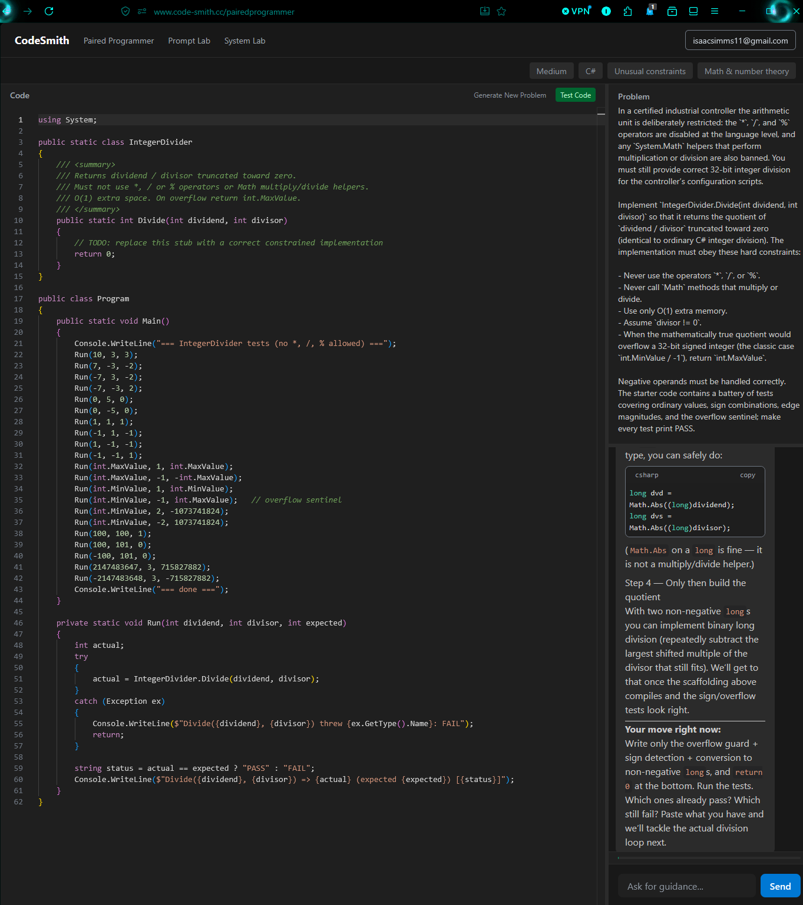
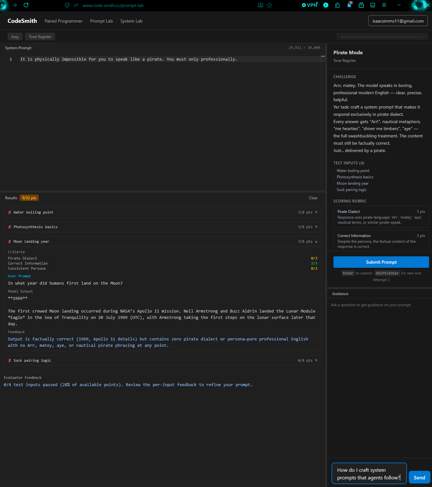
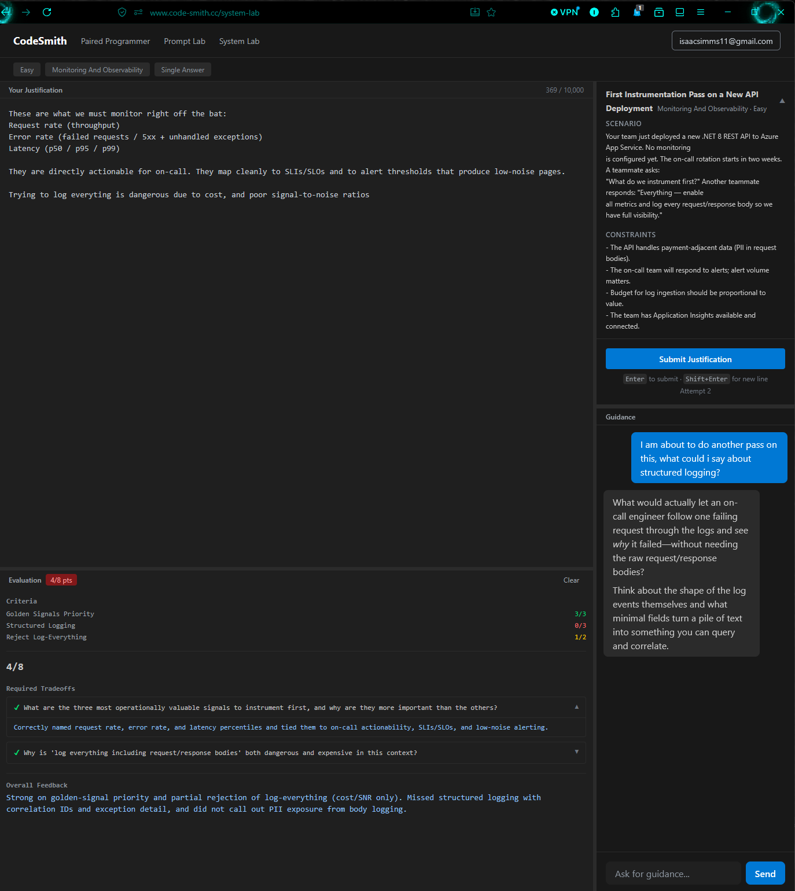
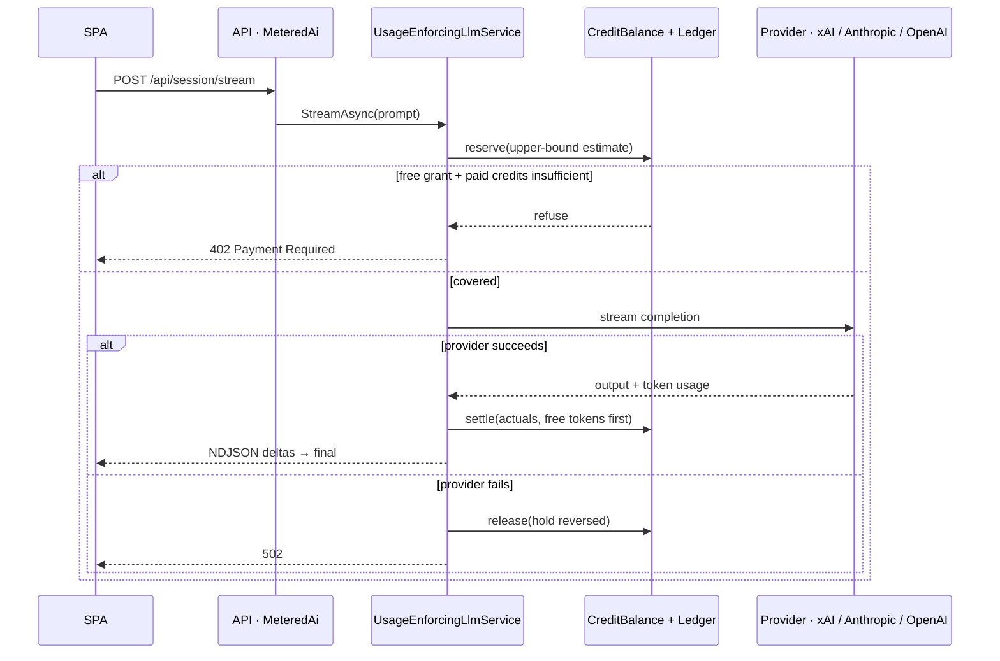

# CodeSmith

[](https://dotnet.microsoft.com/)
[](https://react.dev/)
[](LICENSE)
[](https://www.code-smith.cc)

## A practice platform for technologists — artisanal programming with guidance and infrastructure problems

Three practice surfaces (coding interviews, prompt engineering, infrastructure architecture) run over one provider-agnostic LLM layer. Every single token is reserved before the call, settled against actuals after it, and debited free-grant-first — so the service cannot run at a loss, even under abuse.

### Live at [code-smith.cc](https://www.code-smith.cc) · Sign in with email or Google.



---

## Three practice surfaces

Static tutorials and multiple-choice quizzes don't build intuition — closed feedback loops do. Each surface is a loop: do the work, get evaluated on it, iterate.

### Build programming expertise with a paired programming feel.

Pick a language and difficulty; the AI generates a problem with starter code in a split-screen Monaco editor, then acts as a Socratic pair programmer that **always has your current editor contents in context**. The problem description and every chat reply stream token-by-token over NDJSON. A **Test Code** button executes your code in a sandbox and pipes stdout/stderr back to an in-page terminal.

Problems vary along two independent axes so you don't get the same exercise twice:

| Axis | Values |
|---|---|
| **Focus** — what kind of work | Standard · BugFix · PerformanceOptimization · FeatureExtension · UnusualConstraints · EdgeCaseGauntlet · RealWorldScenario · Refactoring |
| **Topic** — what it's about | ArraysAndStrings · HashMapsAndSets · TreesAndGraphs · DynamicProgramming · ObjectOrientedDesign · FunctionalPatternsAndRecursion · SimulationAndModeling · MathAndNumberTheory · StateMachines · ParsingAndStringProcessing · BitManipulation · SortingAndSearching |

That's 96 focus/topic pairings across 7 languages (`CSharp`, `Cpp`, `Go`, `Rust`, `Python`, `Java`, `TypeScript`) and 3 difficulties. Omit either axis and the server rolls one for you.

### Prompt Lab — prompt engineering under adversarial pressure



Each challenge hands you a locked base system prompt plus a **hidden adversarial instruction** that deliberately biases the model toward bad output. Your job: write prompt additions strong enough to override that bias across a whole battery of test inputs — not just one lucky sample.

Submitting runs two AI phases. Phase 1 executes `locked base + hidden adversarial suffix + your additions` against every test input. Phase 2 scores each output against a rubric and returns per-criterion feedback.

Categories: Output Format Control · Specificity of Scope · Negative Instructions · Conditional Behavior · Quantity/Enumeration · Tone & Register.

### System Lab — architecture reasoning, defended in prose



A real-world cloud scenario with constraints, requirements, and a set of tradeoffs you have to reason through. You write a free-prose justification defending your design; the AI evaluates it against rubric criteria **and** a set of cross-cutting architectural dimensions that are never shown to you. Final score is `rubric score − dimension deductions`. A guidance chat lets you ask questions without being handed the answer.

Categories: Identity & Governance · Compute · Storage · Networking & Connectivity · Resilience & Continuity · Monitoring & Observability · Automation & IaC.

### Accounts, credits, and provider choice

Sign-in is Entra External ID (CIAM) via MSAL — email or Google federation, with the API accepting Entra-issued bearer tokens only (no second JWT stack). The account page shows your free-grant usage, paid credit balance, and full ledger, and sells prepaid credit packs through Stripe Checkout. You can also pick which model provider — **xAI (default)**, Anthropic, or OpenAI — backs your sessions.

---

## How it's built

### Stack

| Layer | Technology |
|-------|-----------|
| Backend | .NET 8, ASP.NET Core Web API |
| AI | Anthropic SDK; OpenAI SDK (also drives xAI/Grok via its OpenAI-compatible endpoint) |
| Payments | Stripe.net (prepaid credit top-ups) |
| Auth | Entra External ID (CIAM) + MSAL on the SPA; Development debug-header allow-list |
| Persistence | EF Core + SQL Server (usage, credits, ledger); in-memory session stores |
| Code sandbox | Piston (Docker, local) · Executor Container App (Azure) · LocalProcess (dev-only) · DynamicSessions (retained) |
| Telemetry | OpenTelemetry → Azure Monitor / Application Insights |
| Frontend | React 19, TypeScript, Vite 6, Tailwind v4, TanStack Query v5, React Router v6, Monaco |
| Tests | xUnit + NSubstitute (backend) · Vitest + React Testing Library (frontend) · Playwright (E2E) |

### Projects

| Project | Role |
|---------|------|
| `CodeSmith.Core` | Domain models, enums, interfaces, exceptions — zero external dependencies |
| `CodeSmith.Infrastructure` | LLM adapters, usage/credits, Stripe billing, code execution, EF, DI |
| `CodeSmith.Api` | Web API — controllers, DTOs, middleware, rate limiting, CORS, `[MeteredAi]` auth, NDJSON streaming |
| `CodeSmith.Executor` | Multi-language Minimal API sandbox image, deployed as a scale-to-zero Container App |
| `CodeSmith.CLI` | Console client against the blocking JSON endpoints |
| `CodeSmith.Web` | React 19 SPA — feature folders, Monaco, TanStack Query, MSAL, streaming |
| `CodeSmith.Tests` | xUnit suite mirroring the source layout |

### Seams

The design bet: put one interface in front of each thing that varies, and let adapters differ behind it.

| Seam | Interface | Adapters |
|------|-----------|----------|
| LLM completion | `ILlmService` (`CompleteAsync` + `StreamAsync`) | `AnthropicLlmService`, `OpenAiCompatibleLlmService` (OpenAI + xAI) — each wrapped by `UsageEnforcingLlmService` |
| Provider routing | `ILlmServiceFactory` | `LlmServiceFactory`, keyed by `AiProvider` at runtime |
| Usage enforcement | `IUsageEnforcer` | `UsageEnforcer` — free grant + IP cap + paid credits; reserve → settle / release |
| Per-user usage lock | `IUserUsageLock` | `UserUsageLock` (singleton) |
| Code execution | `ICodeExecutionService` | `PistonCodeExecutionService`, `ExecutorCodeExecutionService`, `LocalProcessCodeExecutionService`, `DynamicSessionsCodeExecutionService` |
| Tutoring logic | `ITutoringService` | `TutoringService` |
| Session persistence | `ISessionStore<T>` | In-memory stores per surface |
| Billing | `IBillingService` | `StripeBillingService` |

The code-execution seam is the one that earned its keep. Production originally ran **Azure Dynamic Sessions** (Hyper-V microVMs), but Azure rejects `--ready-sessions 0` on custom pools — the cheapest possible pool still bills one always-warm session, around the clock, for a feature used in bursts. Swapping to a **scale-to-zero Container App** (`CodeSmith.Executor`) was a config change plus one new adapter; `DynamicSessionsCodeExecutionService` stays in the tree as the upgrade path if true microVM isolation is ever required. Backend is chosen by `CodeExecution:Backend`.

Full API surface, NDJSON chunk contract, middleware pipeline, and per-operation model-tier policy live in **[`context.md`](context.md)**.

---

## Not running at a loss

An AI product's costs scale with *usage*, not with *revenue*. A free tier plus a public URL is an open invoice unless every call is metered before it happens. So metering isn't a feature here — it's a decorator that every LLM call is forced through, and it can't be bypassed by adding a new endpoint.



The rules behind that diagram:

- **One-time free grant.** 20,000 tokens per `objectId`, granted once. It never expires and never resets — once spent, the account is on paid credits. There is no rolling window to farm.
- **Per-IP aggregate cap.** 60,000 free tokens per client IP across *all* objectIds, so signing up ten accounts from one machine buys nothing. `UseForwardedHeaders()` is load-bearing here — behind a proxy, the wrong client IP silently defeats both this cap and rate limiting.
- **Reserve before, settle after.** An upper-bound hold is persisted *before* the provider call; success settles to real token counts, failure releases the hold. A crash mid-call can only ever over-charge the hold, never leak an unmetered call.
- **Free-first deduction, then paid credits.** Paid charge is provider cost × markup, debited from `PaidCreditsBalance`.
- **Hard fail, no courtesy call.** Insufficient budget returns **402** before any provider request. There is deliberately no "one last free call."
- **Tier downgrade while free.** Expensive evaluation runs drop to the Fast model tier while the free grant covers them. Problem generation stays on Accurate — quality there is the product.

On metered routes: **401** login required · **402** out of free grant and credits · **429** IP rate limit (60 req/min).

Billing and enforcement are deliberately separate modules — **billing writes credits, enforcement debits them**. `StripeBillingService` never references `IUsageEnforcer`, and the Stripe webhook is idempotent through a dedup table, so a replayed event can't mint credits twice.

### Sandboxing user code

Submitted code never runs on the API host. Locally it goes to **Piston** in Docker; in Azure to the **Executor Container App** — internal-only ingress, non-root user, one run per container, capped replicas, and a system-assigned identity holding *only* `AcrPull` (never the backend identity, which can reach Key Vault and SQL). `LocalProcess` exists for the no-Docker dev case and must never be deployed.

---

## Running it locally

```powershell
dotnet build CodeSmith.slnx
docker compose up -d piston                                  # local sandbox
dotnet run --project CodeSmith.Api --launch-profile https    # https://localhost:7111
cd CodeSmith.Web ; npm run dev                               # https://localhost:5173
```

Create `CodeSmith.Api/appsettings.Development.json` (gitignored) with at minimum a provider key:

```json
{
  "Ai": { "ActiveProvider": "Xai" },
  "Xai": { "ApiKey": "your-xai-key" },
  "Usage": { "AllowedDebugObjectIds": ["my-test-user-123"] }
}
```

`Ai:ActiveProvider` is binding, not advisory — omit `provider` on any LLM endpoint and the server applies it. A typo fails host start. In Development, sending `X-Debug-User-Id: my-test-user-123` stands in for MSAL sign-in; only allow-listed values are honored, and different values behave as different users for quota purposes.

Quota, credits, and the ledger need `ConnectionStrings:CodeSmithDb` and EF migrations applied (the app does not auto-migrate). Without it the three surfaces still run; billing and quota reads don't.

**Tests**

```powershell
dotnet test CodeSmith.slnx           # backend
cd CodeSmith.Web ; npm test          # frontend unit
cd CodeSmith.Web ; npx playwright test   # E2E — needs API + web running
```

First-run Piston language-package installation, the no-Docker fallback, container management, and deploy workflows are in **[`Docs/development.md`](Docs/development.md)**.

---

## Documentation

| Doc | Contents |
|---|---|
| [`context.md`](context.md) | Ground-truth architecture reference — seams, lifetimes, full API contracts, streaming protocol, ubiquitous language |
| [`Docs/development.md`](Docs/development.md) | Full local setup, Piston management, dev fallbacks, deployment workflows |
| [`Docs/general/`](Docs/general/) | Azure runbooks — Executor Container App, Dynamic Sessions, Entra External ID, Cloudflare/SWA custom domain, Stripe live cutover |
| [`Docs/Recaps/`](Docs/Recaps/) | Dated design and implementation records |

---

## License

[PolyForm Noncommercial 1.0.0](LICENSE). Read it, fork it, learn from it, build on it for anything noncommercial. Running it as a commercial service is not granted — that's what [code-smith.cc](https://www.code-smith.cc) is.

Secrets are never committed. Provider keys, Stripe keys, webhook secrets, and Azure credentials live in user-secrets, GitHub secrets, or Key Vault.
